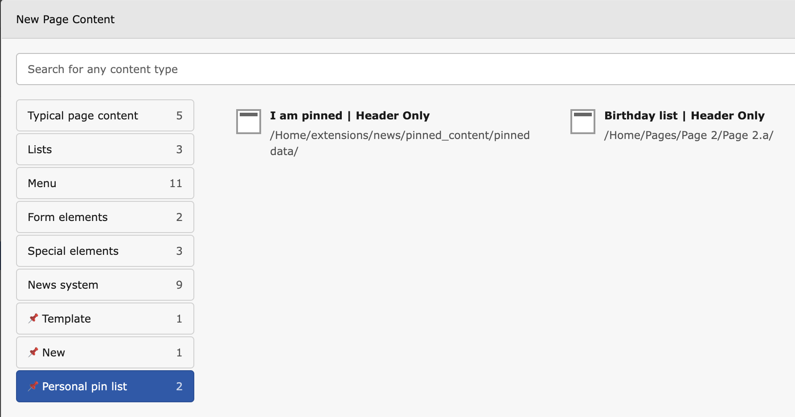
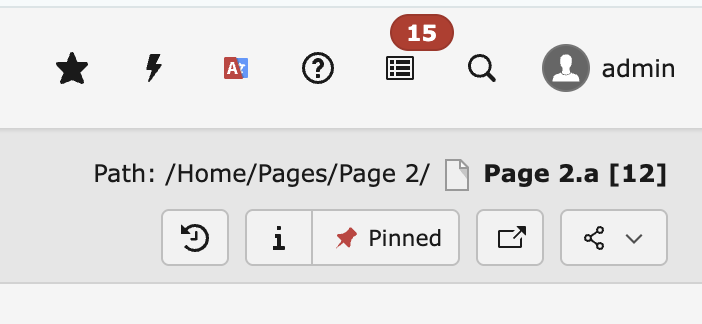

# 📌 TYPO3 Extension `pinned_content`

This extension improves the usage of the **Content Element Wizard** for TYPO3 editors.
Existing content elements can be referenced to be used either as a template or to be copied from.

## ⚙️ Installation

**📦 Requirements**

- TYPO3 **v13.4** or higher

Install via Composer:

    composer req georgringer/pinned-content

or download it from the [TYPO3 Extension Repository (TER)](https://extensions.typo3.org/).

## 🚀 Usage

The extension provides **three modes** for working with pinned content:

### 1️⃣ New

- Create a record *Pinned Content Item*
- Select the type *New*

✨ Helpful for quickly creating a content element with a specific `CType`.

---

### 2️⃣ Template

- Create a record *Pinned Content Item*
- Select the type *Template* and choose an existing content element

📋 Creates a **copy of an existing content element** for reuse.

---

### 3️⃣ Personal Pin List

- Any content element can be pinned to a **personal list** via the toolbar

⭐ Provides quick access to frequently used content elements.

## ⚙️ User settings

You can choose where the pinned groups appear in the Content Element Wizard.

- Open your User menu → User settings → Pinned Content
- Position in wizard: Top or Bottom
- Default: Bottom
